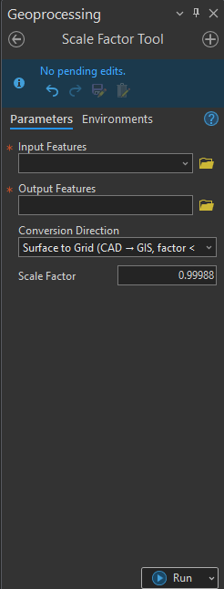
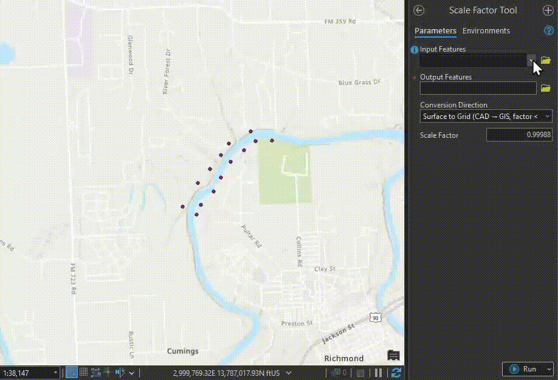
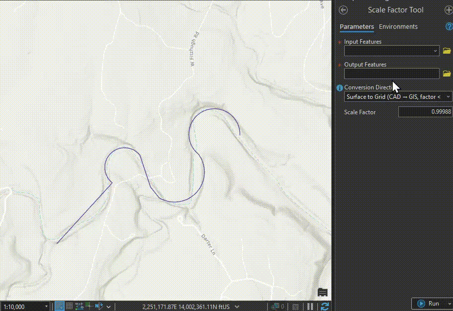
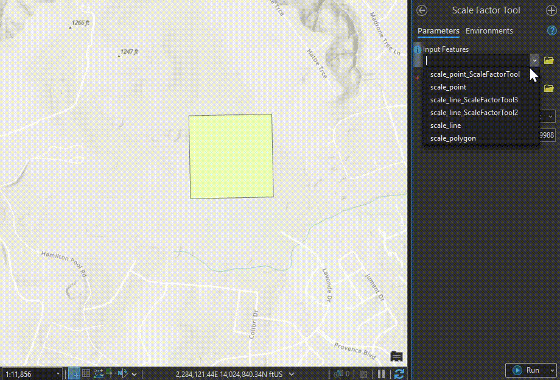

# GIS CAD Scale Factor Tool

An ArcGIS Python Toolbox for converting between GIS grid coordinates and CAD/real-world surface measurements while preserving true curve geometry.


## Screenshots



*The Scale Factor tool interface in ArcGIS Pro*

### Point Conversion

*Scaling point features while preserving coordinates*

### Line Conversion

*Scaling polyline features with curve preservation*

### Polygon Conversion

*Scaling polygon features maintaining boundary integrity*

## Overview

This tool applies scale factors to GIS feature classes, commonly needed when converting between State Plane coordinate systems and ground/surface measurements used in CAD systems. The tool intelligently preserves circular arcs and bezier curves from CAD imports instead of converting them to straight line segments.

## Features

- **Bidirectional Conversion**: Convert from Grid to Surface (GIS → CAD) or Surface to Grid (CAD → GIS)
- **Curve Preservation**: Maintains true circular arcs and bezier curves from CAD geometry
- **Multiple Geometry Types**: Supports Points, Polylines, and Polygons
- **Smart Validation**: Automatic validation of scale factors based on conversion direction
- **Progress Tracking**: Real-time progress updates during processing

## Requirements

- **ArcGIS Pro 3.x** or later
- **Python 3.x** (included with ArcGIS Pro)
- **Advanced ArcGIS license** (for certain geometry operations)

## Installation

### Clone the Repository

```bash
git clone https://github.com/yourusername/gis-cad-scale-factor.git
```

### Add to ArcGIS Pro

1. Open ArcGIS Pro
2. In the Catalog pane, right-click on **Toolboxes**
3. Select **Add Toolbox**
4. Navigate to the downloaded `ScaleFactor.pyt` file
5. Click **OK**

## Usage

### Basic Workflow

1. **Open the tool** from the Catalog pane under Toolboxes

2. **Set parameters**:
   - **Input Features**: Select the feature class to scale
   - **Output Features**: Specify the output location
   - **Conversion Direction**: Choose Grid to Surface or Surface to Grid
   - **Scale Factor**: Enter the appropriate scale factor

3. **Run the tool**

### Scale Factor Guidelines

#### Grid to Surface (GIS → CAD)

- Use scale factors **greater than 1.0**
- Example: 1.00012 for Texas Central State Plane
- Converts from State Plane grid coordinates to ground/surface measurements

#### Surface to Grid (CAD → GIS)

- Use scale factors **less than 1.0**
- Example: 0.99988 for Texas Central State Plane
- Converts from ground/surface measurements to State Plane grid coordinates

### Common Scale Factors by State Plane Zone

| State Plane Zone | Grid to Surface | Surface to Grid |
|------------------|-----------------|-----------------|
| Texas Central    | 1.00012         | 0.99988         |
| Texas North      | 1.00008         | 0.99992         |
| Texas South      | 1.00016         | 0.99984         |

*Note: Scale factors vary by location within each zone. Consult your project's geodetic control for exact values.*

## Example

Converting CAD surface measurements to State Plane grid coordinates:

```
Input: CAD_Import.shp (with curved features)
Output: Grid_Coordinates.shp
Direction: Surface to Grid (CAD → GIS, factor < 1.0)
Scale Factor: 0.99988
```

**Result:** All features scaled by 0.99988, with curved geometry preserved.

## Technical Details

### Curve Preservation

The tool uses ArcGIS's JSON geometry representation to detect and preserve true curves:
- Circular arcs from CAD are maintained as circular arcs
- Bezier curves are preserved
- All coordinate values are scaled while maintaining curve definitions
- Straight line segments are processed using traditional vertex-by-vertex scaling

### Supported Geometry Types

- **Points**: X and Y coordinates scaled, Z values preserved
- **Polylines**: All vertices and curves scaled proportionally
- **Polygons**: All rings scaled, closure automatically maintained

## Troubleshooting

### "Scale factor must be greater/less than 1.0" Error

- Check that your scale factor matches the conversion direction
- Grid to Surface requires factors > 1.0
- Surface to Grid requires factors < 1.0

### Curves Not Preserved

- Ensure input data is stored in a File Geodatabase (not shapefile)
- Shapefiles don't support true curve geometry
- Use Feature Class to Feature Class tool to convert to FGDB if needed

### Output Features Not Appearing

- Check that the output path is valid
- Ensure you have write permissions to the output location
- Verify the output workspace exists

## Contributing

Contributions are welcome! Please feel free to submit a Pull Request.

1. Fork the repository
2. Create your feature branch (`git checkout -b feature/AmazingFeature`)
3. Commit your changes (`git commit -m 'Add some AmazingFeature'`)
4. Push to the branch (`git push origin feature/AmazingFeature`)
5. Open a Pull Request

## License

This project is licensed under the MIT License - see the [LICENSE](LICENSE) file for details.

## Acknowledgments

- Developed for GIS and CAD integration workflows
- Thanks to the ArcGIS Python community for geometry handling best practices

## Author

- GitHub: [@cpickett101](https://github.com/cpickett101)
- Email: christopherbpickett@gmail.com
- LinkedIn: [Christopher Pickett](https://www.linkedin.com/in/christopher-p-a4908979/)

## Support

If you encounter any issues or have questions:
- Open an [issue](https://github.com/cpickett101/gis-cad-scale-factor/issues)
- Check existing issues for solutions
- Submit a pull request

## Version History

- **1.0.0** (2025-10-20)
  - Initial release
  - Support for curve preservation
  - Bidirectional conversion support
  - Automatic scale factor validation

---

**Note:** This tool requires a File Geodatabase for full curve geometry support. Shapefiles do not support true curves and will convert them to line segments.
